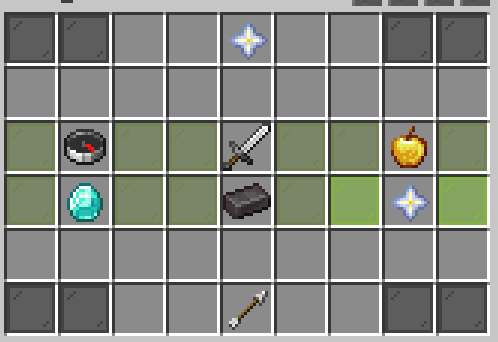

# 👑 Les grades et Pass


**Les grades ne sont valables que pour la saison en cours**


**Les grades sont achetables via des gemmes (**[gagner-des-gemmes.md](../../../introduction/gagner-des-gemmes.md "mention")**) ou par de l'argent IG (** [gagner-de-largent.md](../../../introduction/gagner-de-largent.md "mention")**)**&#x20;

**En entrant la commande `/menu` il vous faudra cliquer sur la pièce menant à la boutique.**

<figure><figcaption></figcaption></figure>

**Dès l'achat de celui-ci, vous obtenez les avantages que celui-ci procure.**

***

## <mark style="color:blue;">Les grades</mark>


Pour acheter un grade il vous faut obligatoirement le précédent


### <mark style="color:green;">**Chevalier**</mark>



500 000 Pièces&#x20;

<mark style="color:red;">**OU**</mark>

500 Gemmes



Compétence:  <mark style="color:orange;">**Appel du Destrier**</mark>&#x20;

Accès au:

* `/feed` -> permet de remplir votre bar de nourriture&#x20;
* `/back` -> vous téléporte en arrière ou vous étiez

Homes: <mark style="color:blue;">**5**</mark>

Accès au zones réservées



Déblocage des kits:

* Chevalier
* Mineur
* Agriculteur



### <mark style="color:yellow;">**Vicomte**</mark>


Bonus: 1 clé Légendaire à l'achat




1 000 000 Pièces

<mark style="color:red;">**OU**</mark>

1 000 Gemmes



Compétence: <mark style="color:yellow;">**Aimant à Butin**</mark>

Accès au:

* `/ec` -> vous permet d'ouvrir votre ender-chest n'importe où

Homes: <mark style="color:blue;">**10**</mark>



Déblocages des kits:

* vicomte
* Alchimiste
* Enchanteur



### <mark style="color:$warning;">**Prince**</mark>


Bonus: 3 clées légendaire à l'achat




2 000 000 Pièces

<mark style="color:red;">**OU**</mark>

2 000 Gemmes



Compétence: <mark style="color:purple;">**Toucher de Midas**</mark>

Homes: <mark style="color:blue;">**15**</mark>



Déblocages des kits:

* Prince
* Mineur
* Agriculteur



## **Roi**


Bonus: 5 clées légendaires




4 000 000 Pièces

<mark style="color:red;">**OU**</mark>

4 000 Gemmes



&#x20;/stonecutter



**Empereur**


* job reset tout les 7j
* Prérequis: lvl 100 jobs



Bonus: 2 clée légendaires




2 000 000 Pièces

<mark style="color:red;">**OU**</mark>

2 000 Gemmes



&#x20;/anvil



***

### <mark style="color:orange;">Pass premium</mark>

Vous donnez accès aux récompenses premium du pass


\
Accès à des tags, pets et particules exclusives


\
Et plus de 60 récompenses exclusives.
