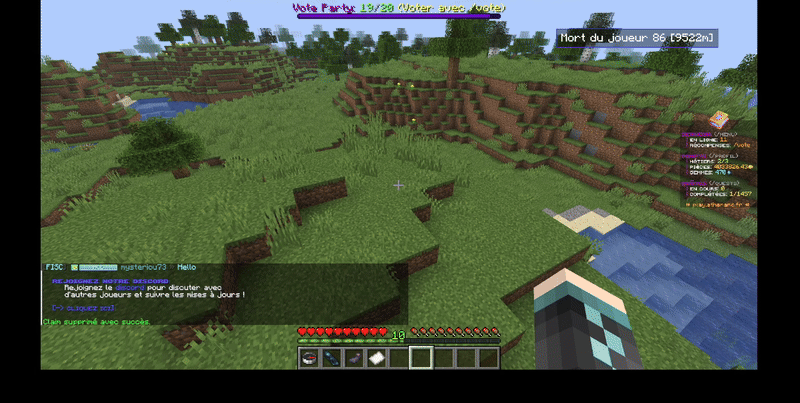
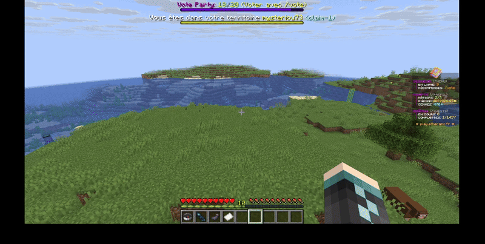
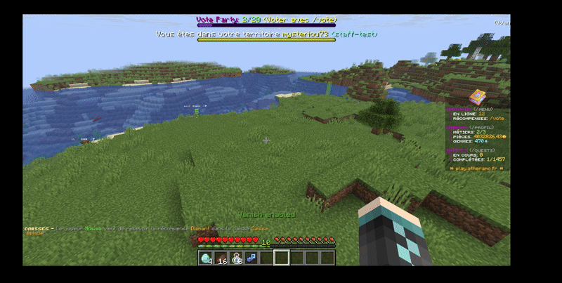

# 🔒 Le système de claim

🔶Les claims

Un claim vous permet de protéger une zone du build, destruction, interaction (ouverture coffre, porte, etc...) des autres joueurs. Elle vous permet ainsi de protéger vos bases, farm, etc...

## 🔶 Comment il fonctionne?

Pour claim une zone, il vous suffit de faire :

&#x20;/claim et de confirmer&#x20;


Chaque claim est payant



{Nom} permet de choisir un claim spécifique

{\*} permet de sélectionner **TOUS** les claims

{Nom du claim <mark style="color:green;">**I**</mark> \*} <mark style="color:green;">**I signifie OU**</mark>


#### /claim

<figure><figcaption></figcaption></figure>

#### /claim addchunk \[Nom du claim]

Vous permet d'expand votre claim sans avoir à merge&#x20;

<figure><figcaption></figcaption></figure>

#### /claim merge claim-1 claim-2

Vous pouvez également merge vos zones (pour éviter d'avoir claim-0, \[...], claim -99), pour ce faire il vous suffit de faire : /claim merge claim-1 claim-2.

Ce message devrait apparaître:

<figure><figcaption></figcaption></figure>

<figure><figcaption></figcaption></figure>

#### /unclaim {nom du claim I \*}

Pour un claim, un ou plusieurs claim, il vous suffit de faire la commande /unclaim et de valider dans l'interface qui va s'ouvrir

<figure><figcaption></figcaption></figure>

#### /claim setname \[ancien nom] \[nouveau nom]

Vous permet de modifier le nom de votre claim

<figure><figcaption></figcaption></figure>

#### /claim add \[Nom du claim I \*] \[pseudo]

Vous permet d'ajouter un membre dans votre claim.


Lui accorde donc les permissions


<figure><figcaption></figcaption></figure>

#### /claim remove \[Nom du claim I \*] \[pseudo]&#x20;

Vous permet de retirer un membre de vos claim

<figure><figcaption></figcaption></figure>

#### /claim settings

Vous permet d'ouvrir les menus de votre claim.

Vous pouvez ainsi paramétrer chaque action possible dans le claim pour les visiteurs, trust.

<figure><figcaption></figcaption></figure>

#### /claim setspawn

Vous permet de définir un point de spawn de votre claim

<figure><figcaption></figcaption></figure>

#### /claim tp \[nom du claim]

<figure><figcaption></figcaption></figure>

#### /claim owner \[nom du claim] {joueur}

Transférer la propriété d'un claim

#### /claim list

Voir tous vos claim

<figure><figcaption></figcaption></figure>

#### /claim members

Voir vos membres dans le claim

<figure><figcaption></figcaption></figure>

#### /claim ban \[Nom du claim I \*] \[pseudo]

Ban un joueur de vos ou tous vos claim

<figure><figcaption></figcaption></figure>
