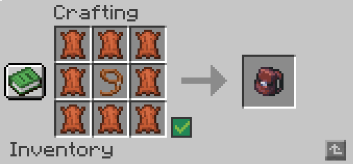

# Les points vote

Lorsque vous votez pour le serveur, vous obtenez **1** Point vote. De plus, chaque vote party vous en octroie **5**.


\
Pour dépenser ces points, vous pouvez utiliser la commande : `/vote-shop`&#x20;

<figure><figcaption></figcaption></figure>

Vous aurez ainsi le choix entre: &#x20;

* 1 clé Rare
* 1 clé Epique
* 1 clé Légendaire
* 1 bâton de ventes 50 utilisation et multiplicateur de 1
