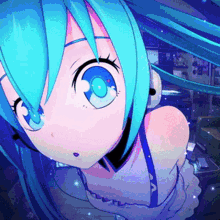

# Gagner de l'argent

## ▶️ Les jobs:

Il vous faut pour commencer rejoindre un job avec la commande: <mark style="color:red;">`/jobs`</mark>

<figure><figcaption></figcaption></figure>

Vous pouvez en sélectionner un maximum de 3 à la fois.

<figure><figcaption></figcaption></figure>

Chaque jobs vous demande de farmez, cassez ou encore posez et tuer des ressources / mobs pour gagnez de <mark style="background-color:blue;">l'xp jobs, de l'argent et des point de métier</mark>


Pour rejoindre un jobs faites maj+clique sur le job en question


## ▶️ L'hôtel de vente (ah)

**Le ah vous permet&#x20;**<mark style="color:red;">**d'acheter**</mark>**&#x20;et de&#x20;**<mark style="color:green;">**vendre**</mark>**&#x20;des item à d'autres joueur**&#x20;


Pour ouvrir le ah faite la commande /ah


<figure><figcaption></figcaption></figure>

**Légende:**

<mark style="color:purple;">**Vous permets de voir vos ventes en cours**</mark>

<mark style="color:$danger;">**Vous permet de voir vos ventes expirer**</mark>

<mark style="color:orange;">**Choisir une catégorie**</mark>

<mark style="color:yellow;">**Page précédentes ou suivante**</mark>

<mark style="color:green;">**Rafraîchir la page**</mark>

**Pour mettre un item en vente il vous suffit de tenir litem dans votre main et de faire:**&#x20;

**/ah sell \[prix] {Nombre d'item (ou ne rien mettre si vous voulez tout vendre)}**

## ▶️ **Le shop**

**Le shop vous permet de vendre ou d'acheter vos ressource à l'admin shop**


Accessible avec le /shop


<figure><figcaption></figcaption></figure>

Légende:


**Les items en ventes et leur prix son succeptible de changer**


<mark style="color:purple;"><strong>Agriculture</strong></mark>

<figure><figcaption></figcaption></figure>

<mark style="color:$danger;"><strong>Loot mob</strong></mark> 

<figure><figcaption></figcaption></figure>

<mark style="color:orange;">Bloc</mark>

<figure><figcaption></figcaption></figure>

La flèches vous permet de naviguer entre les divers pages.

<mark style="color:yellow;">Colorants / fleurs</mark>

<figure><figcaption></figcaption></figure>

<mark style="color:green;">Minerais</mark>

<figure><figcaption></figcaption></figure>

## ▶️ Les coffres de ventes

Les coffre de vente vous permettent aussi de générez de l'argent.

Pour savoir son fonctionnement merci de vous référez au: [coffre-de-vente.md](../gameplay/coffre-de-vente.md "mention")

<figure><figcaption></figcaption></figure>
